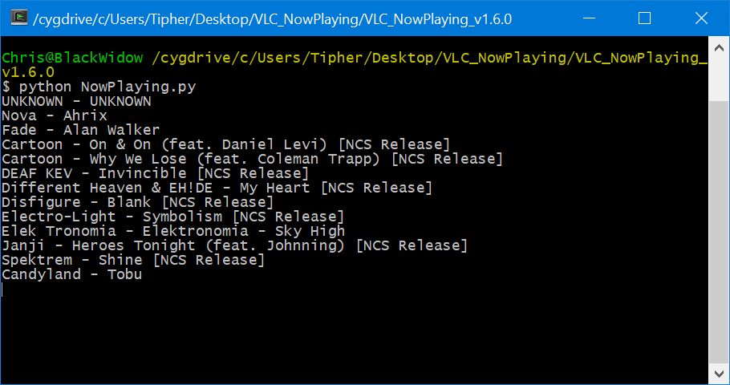
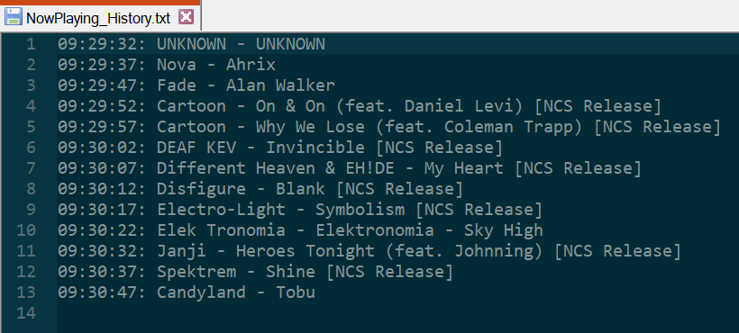

# VLC_NowPlaying 1.7.0

Author:         Tipher88  
Contributors:   AbyssHunted, Etuldan  
Date:           20190227

---

This is a script that allows you to create a NowPlaying.txt file to display song
    information from VLC.

While developing this script I used VLC v2.2.4-v3.0.4 and Python v2.7.10/v3.4.3.

Link to script on [OBS Forums](https://obsproject.com/forum/resources/vlc-nowplaying.244/)

##### Console Output:

##### NowPlaying.txt, contains only the current song + separator::

##### NowPlaying_History.txt, contains all songs played with a timestamp for reference:

## Updates
    
    Version 1.7.0
        - Fixed UnicodeEncodeError caused by improper encoding
    
    Version 1.6.0
        - Added handling for Unicode BOM as well as some minor optimizations
    
    Version 1.5.0
        - Unicode characters should now be supported in the meta-data
        
    Version 1.4.0
        - The script should now handle escaped characters (such as &amp;)
        
    Version 1.3.0
        - The script now generates another file: NowPlaying_History.txt
        
    Version 1.2.0
        - Added support for the now_playing metadata tag
        
    Version 1.1.0
        - Tweaked script in order to support Python v3.x
## Usage
    python NowPlaying.py

## Dependencies
    Python (https://www.python.org/)
        requests (http://www.python-requests.org/en/latest/)

### Instructions for using the script:

The directions assume default VLC settings for the Web Interface before starting.

    Extract the contents of the .zip to a location of your choosing

    VLC:
        1. Open VLC
        2. Go to Tools -> Preferences
        3. On the bottom left select the All radio button in the Show Settings
            group
        4. Click Main Interfaces item in the list on the left
        5. Check the Web check-box
        6. Click the drop-down arrow next to the Main Interfaces item to expand
            the selection
        7. Click the Lua sub-item
        8. Set a password in the Lua HTTP group
        9. Make sure the Source Directory in the same group is set to something
            similar to: C:\Program Files (x86)\VideoLAN\VLC\lua\http
       10. Click the Save button
       11. Close and re-open VLC
    
    Check to make sure Web Interface is active:
        1. Open an internet browser and go to:
            http://localhost:8080/requests/status.xml
        2. Leave the username blank and type in the password you set in VLC
            step 8
        3. If the resulting page is in the form of xml (a bunch of tags with
            names) then the Web Interface is working
    
    Modify the script:
        1. Search the script for the term "CUSTOM" to look at the items you can
            change, they are currently as follows:
            a. The separator string
            b. The password to the Web Interface (needs to match VLC step 8)
            c. The name of the generated file (default is NowPlaying.txt)
            d. The amount of time to wait between checks
    
    Run the script:
        1. Open up your preferred console/terminal used to run python scripts
        2. Change the directory to the location you extracted the .zip to
            initially
        3. Run the command: python NowPlaying.py
        4. Start playing songs in VLC media player
        5. You should see the song info show up in the console
        6. You should see a NowPlaying.txt file appear with the song
            information text and separator appended to the end
        7. You should see a NowPlaying_History.txt file appear with the song
            information as well as a timestamp for reference
        8. Keep the script running while you stream
        9. Enter ctrl + c to exit the script once you are done streaming
    
    OBS (optional):
        1. Add a text source to OBS with the "Use Text From File" pointing to
            the file generated from the script
